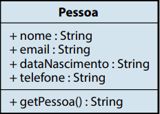
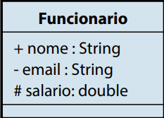
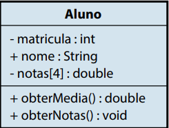

# O que é Programação Orientada a Objetos

## Paradigma

Para Bezerra (2007), o termo paradigma pode ser compreendido como um
modelo ou padrão a ser seguido para a resolução de um problema. No desenvolvimento de software, não existe uma receita de bolo – você, com a sua expertise
e o seu raciocínio lógico, construirá uma solução adequada para cada problema.

 > Fonte: ALVES, F. Programação Orientada a Objetos. In: Bezzera, 2007 **Programação back end II**. 22.ed. Maringa, PR: Centro Universiário de Maringá, 2019. p. 12

Na visão de Dall’Oglio (2009, p. 86), o termo paradigma “representa toda
uma filosofia para a construção de sistemas”, buscando, assim, retratar a visão do
mundo real como um sistema de objetos cooperativos e colaborativos. O mundo
que o autor cita realmente é o mundo real, onde temos objetos que possuem uma
forma, mas com características e comportamentos diferentes.

 > Fonte: ALVES, F. Programação Orientada a Objetos. In: DALL’OGLIO, 2009 **Programação back end II**. 22.ed. Maringa, PR: Centro Universiário de Maringá, 2019. p. 12

## Abordagem Estrutural

O desenvolvimento de software com a abordagem estrutural consiste na construção de um sistema sequencial. Assim, os programas são criados baseados em
quais funções, procedimentos e variáveis são necessárias para resolver um problema. Esse paradigma possui uma estrutura básica com instruções, decisões e interações de forma sequencial. Nessa forma de programar, é possível ainda criar funções/
módulo, ou seja, a divisão do programa em módulos menores (YOURDON, 1990). 

 > Fonte: ALVES, F. Programação Orientada a Objetos. In: YOURDON, 1990 **Programação back end II**. 22.ed. Maringa, PR: Centro Universiário de Maringá, 2019. p. 13

Além de programar em módulo, a abordagem estrutural permite a reutilização de código, ou seja, não é necessário escrever os códigos dessas funções todas
as vezes que for necessário, bastando apenas chamá-los para serem executados
novamente. Mesmo assim, ainda obedece a ordem sequencial lógica do programa,
ou seja, uma instrução após a outra.

 > Fonte: ALVES, F. Programação Orientada a Objetos. In: ALVES, F. **Programação back end II**. 22.ed. Maringa, PR: Centro Universiário de Maringá, 2019. p. 13

## Abordagem Orientada a Objetos

Já o desenvolvimento de software com a abordagem orientada a objetos consiste
na construção de módulos independentes ou objetos que podem ser facilmente
substituídos, modificados e reutilizados. O programador deve conseguir abstrair do problema coisas que podem ser representadas como objetos, como, por
exemplo: se deseja criar um programa para saber se um candidato está ou não
aprovado em um concurso, o programa deverá criar objetos para representar o
candidato e o concurso.

 > Fonte: ALVES, F. Programação Orientada a Objetos. In: ALVES, F. **Programação back end II**. 22.ed. Maringa, PR: Centro Universiário de Maringá, 2019. p. 13

A Orientação a Objetos tem, como principal característica, a forma natural
de tratar a realidade, pois considera que o mundo real é formado por objetos. Os
objetos são definidos em classes – forma com características e comportamentos –,
em que cada objeto criado é denominado de instância (SOMMERVILLE, 2011).

 > Fonte: ALVES, F. Programação Orientada a Objetos. In: SOMMERVILLE, 2011. **Programação back end II**. 22.ed. Maringa, PR: Centro Universiário de Maringá, 2019. p. 13

A Orientação a Objetos é um estilo de programação que permite aos desenvolvedores agruparem tarefas semelhantes em classes. Passamos a visualizar classes
como responsáveis por atributos contidos nelas, com operações criadas para
tratá-los, e a execução das atividades contidas nas classes dos sistemas passam a
depender da interação dessas classes (SOMMERVILLE, 2011).

 > Fonte: ALVES, F. Programação Orientada a Objetos. In: SOMMERVILLE, 2011. **Programação back end II**. 22.ed. Maringa, PR: Centro Universiário de Maringá, 2019. p. 14

# Classes

A classe é uma estrutura que definirá um tipo de dado, podendo conter atributos
e, também, métodos para manipular os atributos da classe. Uma classe representa
a abstração de um conjunto de objetos do mundo real que possui comportamentos e características comuns.

 > Fonte: ALVES, F. Programação Orientada a Objetos. In: DALL’OGLIO, 2009 **Programação back end II**. 22.ed. Maringa, PR: Centro Universiário de Maringá, 2019. p. 15

Podemos exemplificar uma classe como um conjunto de características de um
ser humano, por exemplo: gênero, peso, altura, nome, e-mail, data de nascimento
etc. Essas características se transformam em atributos da classe ou variáveis de
classe. A classe é um modelo para criação dos objetos de um mesmo domínio, ou
seja, cada classe é responsável por um assunto diferente e possui responsabilidade
sobre si mesmo por meio de métodos.

 > Fonte: ALVES, F. Programação Orientada a Objetos. In: ALVES, F. 2009 **Programação back end II**. 22.ed. Maringa, PR: Centro Universiário de Maringá, 2019. p. 15

 

  > Fonte: ALVES, F. Programação Orientada a Objetos. In: ALVES, F. 2009 **Programação back end II**. 22.ed. Maringa, PR: Centro Universiário de Maringá, 2019. p. 16

```php
class NomeDaClasse
{
//instruções;
}
  ```

# Atributo

Atributo é uma característica ou propriedade particular que os objetos de uma
classe possuem, assumindo valores diferentes para cada objeto. Para declarar
um atributo, colocaremos um identificador precedido da visibilidade (public,
private e protected) do atributo.

  > Fonte: ALVES, F. Programação Orientada a Objetos. In: ALVES, F. 2009 **Programação back end II**. 22.ed. Maringa, PR: Centro Universiário de Maringá, 2019. p. 16

```php
class NomeDaClasse
{
public $identificador;
}
  ```

A identificação da visibilidade dos atributos em um diagrama UML é informado por meio
de um símbolo.

**Public**: é visível de qualquer lugar do sistema. No diagrama de classes, é identificado pelo
símbolo “+”.

**Private**: é visível apenas de dentro da classe. Não pode ser acessado de fora da classe. No
diagrama de classes, é identificado pelo símbolo “-“.

**Protected**: é visível de dentro da classe e das subclasses herdadas dessa classe, mas não
de fora. No diagrama de classes, é identificado pelo símbolo “#”.

 > Fonte: ALVES, F. Programação Orientada a Objetos. In: ALVES, F. 2009 **Programação back end II**. 22.ed. Maringa, PR: Centro Universiário de Maringá, 2019. p. 16

 # Objeto

Para Dall’Oglio (2009, p. 93), “um objeto é uma estrutura dinâmica originada com base em uma classe”. Isso significa que um objeto é dinâmico, ou seja,
ele pode sofrer alterações no decorrer do seu curso de vida. O objeto é único e
possui comportamentos e características próprios. Ele é fruto de uma instância
de uma classe (BEZERRA, 2007).

Ainda de acordo Dall’Oglio (2009, p. 93), “o objeto é uma instância de uma
classe, porque o objeto existe durante dado instante de tempo – da sua criação
até a sua destruição”. Analisando este conceito, temos que um objeto é único
no sistema, ou seja, durante a sua vida, ele possui uma referência de memória,
garantindo a ele uma unicidade no sistema.

 > Fonte: ALVES, F. Programação Orientada a Objetos. In: ALVES, F. 2009 **Programação back end II**. 22.ed. Maringa, PR: Centro Universiário de Maringá, 2019. p. 18

Para instanciar um objeto, primeiro, criaremos uma variável que receberá
a instância da classe. Para instanciar uma classe, é utilizado o operador new,
seguido do nome da classe, com abre e fecha parênteses

```php
$objeto = new NomeDaClasse();
```

No exemplo a seguir, fazemos o uso da classe Pessoa, criando um objeto ($pessoa). Para termos o acesso aos atributos da classe, utilizaremos o nome do atributo
precedido pelo nome do objeto.

# Métodos

De acordo com Dall’Oglio (2009), um método é considerado um comportamento ou uma funcionalidade específica e única de uma classe. Isso significa que o
método deve ser único, ou seja, deve possuir apenas uma única funcionalidade. É
por esse motivo que os métodos são considerados de responsabilidades das classes. O método da classe em PHP segue os mesmos princípios de uma function,
apenas possui, no início de sua declaração, a visibilidade do método. Confira a
sintaxe a seguir:

```php
public function nomeFuncao()
{
//instruções
//
}
```
 > Fonte: ALVES, F. Programação Orientada a Objetos. In: ALVES, F. 2009 **Programação back end II**. 22.ed. Maringa, PR: Centro Universiário de Maringá, 2019. p. 20

## Método Construtor

O método construtor é um método especial, executado na instância da classe
pelo operador new, e esse método não produz um valor de retorno, pois estará retornando o próprio objeto. Todavia, o desenvolvedor pode implementar,
em suas classes, o método construtor, e ele será chamado a cada objeto recém-criado. É adequado para qualquer inicialização que o objeto necessite
antes de ser utilizado

 > Fonte: ALVES, F. Programação Orientada a Objetos. In: ALVES, F. 2009 **Programação back end II**. 22.ed. Maringa, PR: Centro Universiário de Maringá, 2019. p. 23

Para criar uma instância de uma classe, a instrução new deve ser utilizada. Um objeto sempre será criado exceto se a classe tiver um construtor definido que dispare uma exceção
em caso de erro. Classes devem ser definidas antes de instanciadas – e, em alguns casos,
isso é obrigatório.

Se uma string, contendo o nome da classe, é utilizada com new, uma nova instância da
classe será criada

```php
<?php
$instance = new SimpleClass();
// Também pode ser feito com uma variável:
$className = 'SimpleClass';
$instance = new $className(); // new SimpleClass()
?>
```
> Fonte: PHP ([2020], on-line)

Para declarar o método construtor em uma classe, seguiremos a sintaxe a seguir.

```php
function __construct()
{
//instruções
}
```

## Método destrutor

O método destrutor é um outro método especial executado automaticamente
quando o objeto é desalocado da memória. Esse processo pode ocorrer de forma
natural, ou seja, quando terminar as chamadas do objeto à classe ou quando forçamos o PHP a liberar a referência do objeto pelo comando apresentado a seguir.
Para implementar o método destrutor, siga a sintaxe a seguir:

```php

function __destruct()
{
//instrução
}

```

 > Fonte: ALVES, F. Programação Orientada a Objetos. In: ALVES, F. 2009 **Programação back end II**. 22.ed. Maringa, PR: Centro Universiário de Maringá, 2019. p. 26

 # Modificadores de acesso PUBLIC, PRIVATE e PROTECTED

 
 > Fonte: ALVES, F. Programação Orientada a Objetos. In: ALVES, F. 2009 **Programação back end II**. 22.ed. Maringa, PR: Centro Universiário de Maringá, 2019. p. 28

 
  > Fonte: ALVES, F. Programação Orientada a Objetos. In: ALVES, F. 2009 **Programação back end II**. 22.ed. Maringa, PR: Centro Universiário de Maringá, 2019. p. 33
  
 Até aqui, trabalhamos com a visibilidade **public** [notação UML (**+**)] dos atributos
e métodos. Este é o nível de acesso mais permissivo, pois ele indica que o método
ou atributo da classe é público, ou seja, pode ser acessado em qualquer outro ponto do código e por outras classes. Contudo, ainda temos mais duas visibilidades
(private e protected). Com essas visibilidades, definimos se o atributo ou método
pode ou não ser acessado fora da classe em que foi declarado.

A visibilidade **private** [notação UML (**-**)] significa que membros declarados
com essa visibilidade só podem ser acessados de dentro da própria classe em que
foram declarados. Desta forma, os membros não podem ser acessados de fora
da classe em que eles estão contidos.

A visibilidade **protected** [notação UML (**#**)] significa que membros declarados com essa visibilidade só podem ser acessados pela
própria classe ou classes filhas da
classe principal

 > Fonte: ALVES, F. Programação Orientada a Objetos. In: ALVES, F. 2009 **Programação back end II**. 22.ed. Maringa, PR: Centro Universiário de Maringá, 2019. p. 28

 Para modificar a visibilidade de um atributo ou método, devemos proceder sua
declaração de uma das palavras reservadas que representam o modificador para
o atributo e método da seguinte forma:

```php
modificador $atributo;
modificador function metodo()
{
//instruções
}
```

Para que seja possível acessar os atributos private e protected, necessitamos de
métodos públicos, conhecidos como modificadores de acesso **setters** e **getters**,
que setam e resgatam valores, respectivamente.

```php
modificador function setNomeDaVariavel(<parâmetro>)
{
$this-><atributo> = <parâmetro>;
}
```

O método **setter** recebe, por parâmetro, o valor a ser armazenado no atributo
da classe.

```php
modificador function getNomeDaVariavel()
{
return $this-><atributo>;
}
```

Os modificadores de acesso são de extrema importância em um projeto, pois estão ligados diretamente a critérios de segurança e pontos de acesso ao código. Tais
princípios estão ligados, também, a boas práticas em desenvolvimento