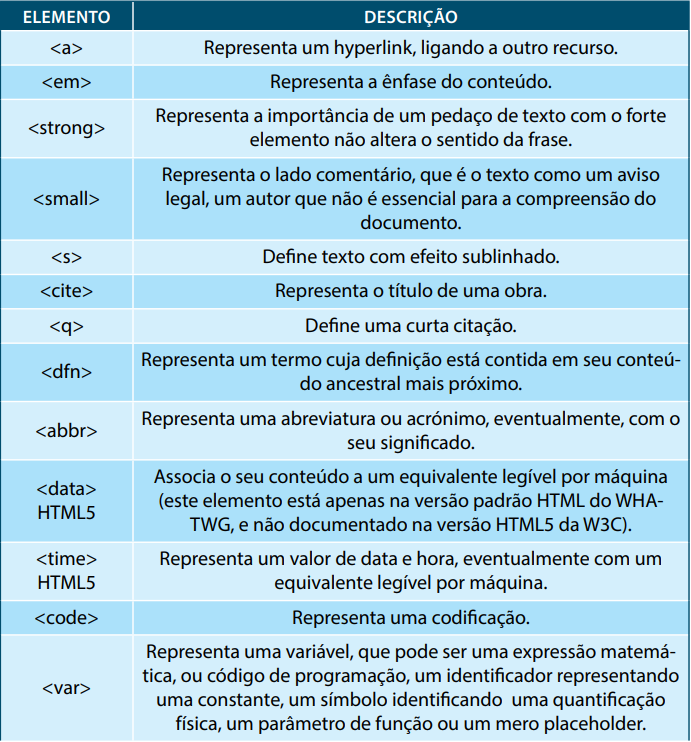
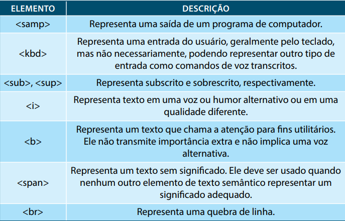

# dev-front-end-1

# Tags de conteúdo com semântica interna (inline)

# Tags para separação de conteúdo
[SeparacaoConteúdo)](img/SeparacaoConteúdo.png)

# Formatos e suas características
[Formatoimgs)](img/Formatoimgs.png)

Principais tipos disponíveis para elemento input
[ElementoInput)](img/ElementoInput.png)
[formulário)](img/formulário.png)

