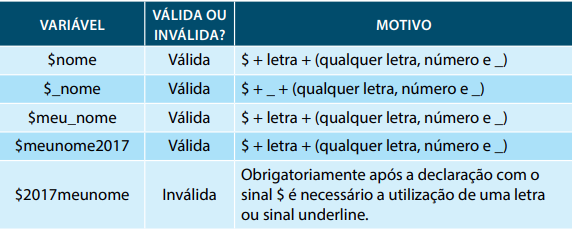

# Tópicos

- [LinguagemPHP](#Linguagem-PHP)

- [Formulários](#Formulários)


# Oque faz um bom programador?

O que faz um bom programador?
Muita gente se pergunta como se tornar um bom programador. Normalmente estão mais
preocupados em qual linguagem aprender, qual curso fazer, quais livros técnicos ler. Porém podemos dizer que existem qualidades mais importantes a se levar em conta. [...].
Um bom programador é um pensador analítico.
Programadores precisam ser solucionadores de problemas.
O processo de programação requer que possamos quebrar problemas complicados, planejar e implementar soluções e encontrar pequenas inconsistências no código (bugs).
Pensamento analítico também se manifesta na habilidade de seguir e entender lógicas
complicadas através de segmentos de código. Isso nos permite alcançar conceitos abstratos como metodologias de Orientação a Objetos e design patterns (padrões de projetos),
implementando-os em prática.
Um bom programador tem suas prioridades claras.
Se eu lhe pedisse para ordenar os itens seguintes por prioridade, como você os ordenaria?
• Segurança
• Mantenabilidade
• Usabilidade
• Performance
• Quantidade de LOC (lines of code – linhas de código)

> Fonte: Eu Faço Programas (O QUE FAZ..., 2019, on-line).
> 
# Linguagem PHP

## Vantagens do PHP

 > Fonte: HERBERT, R. B. Introdução ao PHP. In: HERBERT, R. B. **Programação back end I**. 22.ed.rv. Maringa, PR: Centro Universiário de Maringá, 2019. p. 56

## Uso do PHP nas aplicações web


 > Fonte: HERBERT, R. B. Introdução ao PHP. In: HERBERT, R. B. **Programação back end I**. 22.ed.rv. Maringa, PR: Centro Universiário de Maringá, 2019. p. 57-58

## Tipos de dados


 > Fonte: HERBERT, R. B. Introdução ao PHP. In: HERBERT, R. B. **Programação back end I**. 22.ed.rv. Maringa, PR: Centro Universiário de Maringá, 2019. p. 66-67

## Declaração de variáveis válidas e inválidas


 > Fonte: HERBERT, R. B. Introdução ao PHP. In: HERBERT, R. B. **Programação back end I**. 22.ed.rv. Maringa, PR: Centro Universiário de Maringá, 2019. p. 67-68

## Operadores Aritméticos no PHP

 > Fonte: HERBERT, R. B. Introdução ao PHP. In: HERBERT, R. B. **Programação back end I**. 22.ed.rv. Maringa, PR: Centro Universiário de Maringá, 2019. p. 70

## Diferenças entre uma constante e variável

 > Fonte: HERBERT, R. B. Introdução ao PHP. In: HERBERT, R. B. **Programação back end I**. 22.ed.rv. Maringa, PR: Centro Universiário de Maringá, 2019. p. 74

# Formulários
## Tags de conteúdo com semântica interna (inline)

| Tag | Significado |
| ------ | ------ |
| `<a>` | Representa um hyperlink, ligando a outro recurso. |
| `<em>` | Representa a ênfase do conteúdo. |
| `<strong>`| Representa a importância de um pedaço de texto com o forte elemento não altera o sentido da frase. |
| `<small>` | Representa o lado comentário, que é o texto como um aviso legal, um autor que não é essencial para a compreensão do documento. |
| `<s>` |Define texto com efeito sublinhado |
| `<cite>` | Representa o título de uma obra. |
| `<q>` | Define uma curta citação |
| `<dfn>`| Representa um termo cuja definição está contida em seu conteúdo ancestral mais próximo. |
| `<abbr>` | Representa uma abreviatura ou acrónimo, eventualmente, com o seu significado. |
| `<data>`HTML5| Associa o seu conteúdo a um equivalente legível por máquina (este elemento está apenas na versão padrão HTML do WHATWG, e não documentado na versão HTML5 da W3C).|
| `<time>` HTML5 |Representa um valor de data e hora, eventualmente com um equivalente legível por máquina |
| `<code>` | Representa uma codificação. |
| `<var>`| epresenta uma variável, que pode ser uma expressão matemática, ou código de programação, um identificador representando ma constante, um símbolo identificando uma quantificação física, um parâmetro de função ou um mero placeholder 
| `<samp>` | Representa uma saída de um programa de computador |
| `<kbd>` | Representa uma entrada do usuário, geralmente pelo teclado, mas não necessariamente, podendo representar outro tipo de entrada como comandos de voz transcritos. |
| `<sub>`, `<sup>` | Representa subscrito e sobrescrito, respectivamente |
| `<i>`| Representa texto em uma voz ou humor alternativo ou em uma qualidade diferente. |
| `<b>` |Representa um texto que chama a atenção para fins utilitários. Ele não transmite importância extra e não implica uma voz alternativa. |
| `<span>` |Representa um texto sem significado. Ele deve ser usado quando nenhum outro elemento de texto semântico representar um significado adequado.|
| `<br>`| Representa uma quebra de linha |

> Fonte:  Mozilla Developer Network ([2018], on-line)
  
## Tags para separação de conteúdo
| ELEMENTO | DESCRIÇÃO |
| ------ | ------ |
| `<section>` | Define a seção do documento |
| `<nav>` | Define uma seção que contém apenas links de navegação. |
| `<article>` |Define que pode existir de forma independente do resto do conteúdo. Esta tag poderia ser uma postagem no fórum ou um artigo de revista ou jornal.|
| `<aside>` | Define um conteúdo reservado do resto do conteúdo da página. Se for removida, o conteúdo restante ainda faz
sentido. |
| `<h1>, <h2>, <h3>, <h4>, <h5>, <h6>`| São elementos que representam os seis níveis de títulos de cabeçalhos dos documentos. Um elemento título descreve brevemente o tema da seção. |
| `<hgroup>` | Agrupa os elementos de cabeçalho h1, h2, h3, h4, h5 e h6.|
| `<header>`| Define o cabeçalho de uma página ou seção. Muitas vezes contém um logotipo, o título do site e um menu de navegação do conteúdo. |
| `<footer>` | Define o rodapé de uma página ou seção. |
| `<address>` | Define uma seção que contém informações de contato, como endereço e telefone. |
| `<main>` | Define o conteúdo principal ou importante no documento. Existe apenas um elemento `<main>` no documento. |

> Fonte: Mozilla Developer Network ([2018], on-line)

## Formatos de imagens e suas características

| FORMATO | TRANSPARÊNCIA | ANIMAÇÃO | NAVEGADOR
| ------ | ------ | ------ | ------ |
| GIF | Sim | Sim | Todos |
| PNG | Sim | Não | Todos |
| JPEG| Não | Não | Todos |


## Principais tipos disponíveis para elemento input

| TIPO (TYPE) | DESCRIÇÃO | OBSERVAÇÕES
| ------ | ------ | ------ |
| `text` | mostra uma caixa de texto de uma linha e permite a entrada de valores numéricos ou alfanuméricos| O tel não impõe nenhuma sintaxe particular, portanto, se quiser determinar um formato específico, use *pattern* ou *setCustomValidity()* para validação adicional. |
| `password` |utilizado para a digitação de senhas. São mostrados asteriscos (*) no lugar dos caracteres. |
| `hidden` | é um campo escondido. Não aparece na tela. |
| `checkbox` |exibe uma caixa de seleção que pode ser marcada ou desmarcada. |
| `radio` | são botões de seleção em que o usuário escolhe uma entre várias opções dispostas. |
| `file`| permite o envio de arquivos. |
| `submit` | botão que aciona o envio dos dados do formulário |
| `checkbox` |exibe uma caixa de seleção que pode ser marcada ou desmarcada. |
| `image` |tem a mesma função do submit, mas utiliza uma imagem ao invés do botão tradicional |
| `reset` |limpa todos os campos do formulário |
| `tel` | usado para inserir número de telefone suportando máscaras através dos `patterns` e `validação`. |
| `search` |  usado especificamente para buscas. | A diferença entre *search* e *text* é basicamente estilística. O uso de uma entrada do tipo search pode fazer com que o campo de entrada fique com o mesmo estilo dos campos de pesquisa da plataforma usada. |
| `url` | para digitação de URLs absolutas ou relativas com verificação do padrão | A função do url é inserir um URL único e absoluto (link em inglês), que representa uma grande extensão de valores. |
| `e-mail` |para digitação de e-mails com verificação do padrão. | Se for especificado o atributo *multiple*, podem ser inseridos vários endereços de e-mail, separados por vírgulas. |
| `datetime`, `date` e `time` | utilizados para acrescentar recurso de calendário para escolha de dia, mês e ano. No caso de datetime e time com abrindo a possibilidade para escolher horário com o fuso horário em UTC.|
| `datetime-local` | 	Para inserir data e hora sem fuso horário. |
|`week e month` | para digitação da semana do ano ou seleção do mês. | Um exemplo deste formato é 2011-W05 para a quinta semana de 2011. |
| `number` | para digitação de URLs absolutas ou relativas com verificação do padrão |
| `e-mail` | específico para números |
| `range` | abrindo a possibilidade de um tipo de campo que faz um intervalo para escolher, por exemplo, entre 10 e 100. | A implementação do controle de intervalo é um controle deslizante na maioria dos navegadores que têm suporte. |
|`color`| utilizado para componentes onde o usuário precisa escolher uma cor e para isso será disponibilizado uma paleta de cores amigável. |
| `autofocus` | faz com que o cursor do mouse vá para o campo em questão no carregamento da página.| autofocus pode ser aplicado para entrada, seleção, área de texto e botão. |
| `placeholder` | insere um texto anterior já no campo de texto, geralmente como auxílio. Quando o usuário clica no campo o texto se apaga. Este recurso é muito comum. | O valor do placeholder aparece em texto claro até que o elemento seja destacado e o usuário insira alguns dados. Pode ser especificado na entrada e área de texto. |
| `form` | Especifica um ou mais formulários aos quais o elemento de entrada pertence. | Usando o atributo *form*, os elementos de entrada podem ser colocados em qualquer lugar da página, não apenas no elemento de formulário. Além disso, um único elemento de entrada também pode ser associado a mais de um formulário. |
| `required` |  valida se o campo foi preenchido e do contrário trava o campo. É um atributo booleano | O atributo required é útil para realizar a validação baseada no navegador sem usar JavaScript personalizado. |
| `pattern` | especifica um padrão de preenchimento para o campo como máscara de telefone ou cep, por exemplo | Ao usar um *pattern*, você deve especificar também um valor *title* para dar ao usuário uma descrição do padrão esperado. |
| `autocomplete` | Especifica que um campo não deve ser preenchido automaticamente ou pré-preenchido pelo navegador de acordo com as entradas anteriores de um usuário. | O atributo *autocomplete* serve para campos como número de cartão de crédito ou senha de autenticação, casos em que o preenchimento automático não é recomendável. Por padrão, autocomplete possui o estado on, portanto, se desejar desativá-lo, coloque-o em off. |
| `dirname` | Usado para enviar a direcionalidade do controle com o formulário. | Por exemplo, se o usuário inserir dados de texto com direcionalidade da direita para a esquerda e o elemento de entrada contiver o atributo *dirname*, então, uma indicação da direcionalidade da direita para a esquerda será enviada junto com o valor de entrada. |
| `novalidate` | 	Usado para desativar a validação de envio de formulário quando especificado em um elemento de formulário. |
| `formaction` | Usado para substituir o atributo action no elemento de formulário. | Este atributo é suportado nos elementos *input* e *button*. |
 | `formenctype` |  Usado para substituir o atributo enctype no elemento de formulário. | Este atributo é suportado nos elementos *input* e *button*. |
 | `formmethod` | 	Usado para substituir o atributo method no elemento de formulário. | Este atributo é suportado nos elementos *input* e *button*. |
 | `formtarget` | 	Usado para substituir o atributo target no elemento de formulário. | Este atributo é suportado nos elementos *input* e *button*.
 
> Fonte: Niederauer (2017, p.127).
  
 ## Outros elementos para utilização em um formulário
  
| Elemento | Significado |
| ------ | ------ |
| `select` | cria uma lista de seleção (combobox) que permite a escolha dentro de uma lista de itens |
| `option` | são os elementos internos de um elemento select |
| `textarea` | faz a criação de um elemento de texto que permite o envio de mais de uma linha diferentemente do tipo text. |
| `button` | tem comportamento similar ao input do tipo submit e é muito comum para uso em aplicações javascript. |
| `label` | cria os rótulos para dar anteceder os nossos campos. Não são obrigatórios mas eu recomendo o uso até por uma questão de semântica. |
 
| Elemento | Finalidade | Observações
| ------ | ------ | ------ |
| `progress` | Representa o andamento da execução de uma tarefa. | O elemento progress pode representar o andamento do upload de um arquivo. |
| `meter` | Representa uma medida escalar dentro de um intervalo conhecido.| O elemento meter pode ser usado para representar algo como uma medida de temperatura ou peso. |
| `datalist` | Representa um conjunto de elementos option que podem ser usados em combinação com o novo atributo list para entrada de criação de menus suspensos. | Quando a entrada com a lista de dados associada fica em destaque, um menu suspenso aparece e apresenta os valores de datalist. |
| `keygen` |	Um controle para geração de um par de chaves. | Quando o formulário é enviado, a chave privada fica armazenada no keystore, e a chave pública é enviada ao servidor. |
| `output` | cria os rótulos para dar anteceder os nossos campos. Não são obrigatórios mas eu recomendo o uso até por uma questão de semântica. | Exibe os resultados de um cálculo. | Um exemplo do uso do elemento output é a exibição da soma dos valores de dois elementos de entrada |
  
  
 > Fonte: HERBERT, R. B. HTML. In: HERBERT, R. B. **Programação back end I**. 22.ed.rv. Maringa, PR: Centro Universiário de Maringá, 2019. p. 35

 # Configurar o php no Visual Studeo Code

Digite **CTRL+SHIFT+P** E abra o arquivo **JSON SETTINGS**

Coloque o seguinte código:

```json
  "workbench.startupEditor": "newUntitledFile",
    "window.zoomLevel": 0,
    //Quando salvar, forma o código automaticamente
    "editor.formatOnSave": true,

    //Ignora a verificação dos seguintes arquivos
    "files.watcherExclude": {
        "**/.git/objects/**": true,
        "**/.git/subtree-cache/**": true,
        "**/node_modules/*/**": true,
        "**/.hg/store/**": true,
        "**/vendor/*/**": true
    },
    //Oque eu não quero que apareça no explore
    "files.exclude": {
        "**/.classpath": true,
        "**/.project": true,
        "**/.settings": true,
        "**/.factorypath": true
    },

    //PHP
    //Caminho do php.exe
    "php.validate.executablePath": "/opt/lampp/bin/php",
    "php.suggest.basic": false, //Não usa o php padrão do vscode
    "phpSniffer.run": "onType", //Enquanto estiver digitando o código, procura erros
    "phpSniffer.autoDetect": true,
    "phpSniffer.standard": "PSR12",
    "[php]": {
        "editor.defaultFormatter": "wongjn.php-sniffer"
```
- Link gist com settings.json:
https://gist.github.com/frv-dev/51b9f1c8adf5c7809affae55e0e229e6

- Link composer: 
https://getcomposer.org/

- Link do github do code sniffer:
https://github.com/squizlabs/PHP_CodeSniffer

# Extensões:

Extensões:

- Code Runner: https://marketplace.visualstudio.com/items?itemName=formulahendry.code-runner

- DotEnv: https://marketplace.visualstudio.com/items?itemName=mikestead.dotenv

- EditorConfig for VSCode: https://marketplace.visualstudio.com/items?itemName=EditorConfig.EditorConfig

- Path Intelisense: https://marketplace.visualstudio.com/items?itemName=christian-kohler.path-intellisense

- Twig: https://marketplace.visualstudio.com/items?itemName=mblode.twig-language
  
- PHP Intelephense: https://marketplace.visualstudio.com/items?itemName=bmewburn.vscode-intelephense-client

- PHP Debug: https://marketplace.visualstudio.com/items?itemName=felixfbecker.php-debug

- PHP DocBlocker: https://marketplace.visualstudio.com/items?itemName=neilbrayfield.php-docblocker

- PHP Sniffer: https://marketplace.visualstudio.com/items?itemName=wongjn.php-sniffer

- PHP Getters & Setters: https://marketplace.visualstudio.com/items?itemName=phproberto.vscode-php-getters-setters

- PHP Unit: https://marketplace.visualstudio.com/items?itemName=emallin.phpunit

- PHP Unit Test Explorer: https://marketplace.visualstudio.com/items?itemName=recca0120.vscode-phpunit