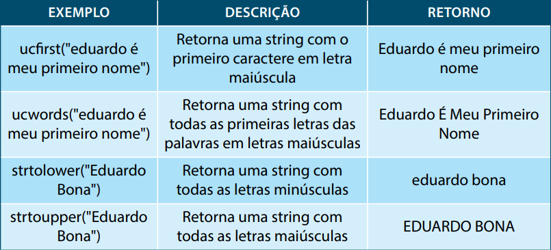
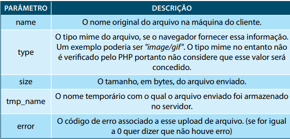

# Tópicos

- [Funções para Processamento de texto](#Funções-para-processamento-de-texto-(strings))

- [Funções Matemáticas](#Funções-matemáticas)

- [Funções para Manipulação de Arrays](#Funções-para-manipulação-de-Arrays)

- [Funções para Sistema de Arquivos](#Funções-para-Sistema-de-Arquivos)

- [Parâmetros para Envio de Email](#Parâmetros-para-Envio-de-Email) 

# Funções para processamento de texto (strings)

## Funções mais comuns do PHP para Strings

 > Fonte: HERBERT, R. B. Funções no PHP. In: HERBERT, R. B. **Programação back end I**. 22.ed.rv. Maringa, PR: Centro Universiário de Maringá, 2019. p. 125

## Funções mais comuns para String com comportamento de análise

  > Fonte: HERBERT, R. B. Funções no PHP. In: HERBERT, R. B. **Programação back end I**. 22.ed.rv. Maringa, PR: Centro Universiário de Maringá, 2019. p. 125-126

## Funções para escapes de texto

 > Fonte: HERBERT, R. B. Funções no PHP. In: HERBERT, R. B. **Programação back end I**. 22.ed.rv. Maringa, PR: Centro Universiário de Maringá, 2019. p. 127

# Funções matemáticas

 > Fonte: HERBERT, R. B. Funções no PHP. In: HERBERT, R. B. **Programação back end I**. 22.ed.rv. Maringa, PR: Centro Universiário de Maringá, 2019. p. 128-129

# Funções para manipulação de Arrays

 > Fonte: HERBERT, R. B. Funções no PHP. In: HERBERT, R. B. **Programação back end I**. 22.ed.rv. Maringa, PR: Centro Universiário de Maringá, 2019. p. 130-131

## Funções básicas para validação em arrays

 > Fonte: HERBERT, R. B. Funções no PHP. In: HERBERT, R. B. **Programação back end I**. 22.ed.rv. Maringa, PR: Centro Universiário de Maringá, 2019. p. 133

## Funções para ordenação de um array

 > Fonte: HERBERT, R. B. Funções no PHP. In: HERBERT, R. B. **Programação back end I**. 22.ed.rv. Maringa, PR: Centro Universiário de Maringá, 2019. p. 134

## Constantes para ordenação de arrays

 > Fonte: HERBERT, R. B. Funções no PHP. In: HERBERT, R. B. **Programação back end I**. 22.ed.rv. Maringa, PR: Centro Universiário de Maringá, 2019. p. 135

# Funções para Sistema de Arquivos

## Funções para Manipulação de Arquivos

 > Fonte: HERBERT, R. B. Funções no PHP. In: HERBERT, R. B. **Programação back end I**. 22.ed.rv. Maringa, PR: Centro Universiário de Maringá, 2019. p. 136-137

- 'r' -> abre somente para leitura; coloca o ponteiro no começo do arquivo.

- 'r+' -> abre para leitura e gravação; coloca o ponteiro no começo do arquivo.

- 'w' -> abre somente para gravação; coloca o ponteiro no começo do arquivo e apaga o conteúdo que já foi escrito. Se o arquivo não existir, tenta criá-lo.

- 'w+' -> abre para leitura e escrita; coloca o ponteiro no início do arquivo e apaga o conteúdo que já foi escrito. Se o arquivo não existir, tenta criá-lo.

- 'a' -> abre o arquivo somente para escrita; coloca o ponteiro no fim do arquivo. Se o arquivo não existir, tenta criá-lo.

- 'a+' -> abre o arquivo para leitura e gravação; coloca o ponteiro no fim do arquivo. Se o arquivo não existir, tenta criá-lo.

Segundo o site *vivaolinux*, disponibilizado em: https://www.vivaolinux.com.br/artigo/Manipulacao-de-arquivos-com-PHP , Com estas três funções você pode criar, escrever e fechar um arquivo facilmente. Lembrando que você também pode usar a função fputs() (http://www.php.net/manual/pt_BR/function.fputs.php) para escrever em um arquivo.

### Funções extras
- explode() - divide uma string.
- opendir() - abre um diretorio.
- readdir() - lê os arquivos de um diretório.
- closedir() - fecha um diretório.
- file_exists() - verifica se um arquivo existe.

## Função para recuperar e salvar arquivos em PHP

 > Fonte: HERBERT, R. B. Funções no PHP. In: HERBERT, R. B. **Programação back end I**. 22.ed.rv. Maringa, PR: Centro Universiário de Maringá, 2019. p. 138

## Ìndices contidos em um array de input type=file (upload) para cada arquivo

 > Fonte: HERBERT, R. B. Funções no PHP. In: HERBERT, R. B. **Programação back end I**. 22.ed.rv. Maringa, PR: Centro Universiário de Maringá, 2019. p. 167

## Parâmetros para Envio de Email

 > Fonte: HERBERT, R. B. Funções no PHP. In: HERBERT, R. B. **Programação back end I**. 22.ed.rv. Maringa, PR: Centro Universiário de Maringá, 2019. p. 172
