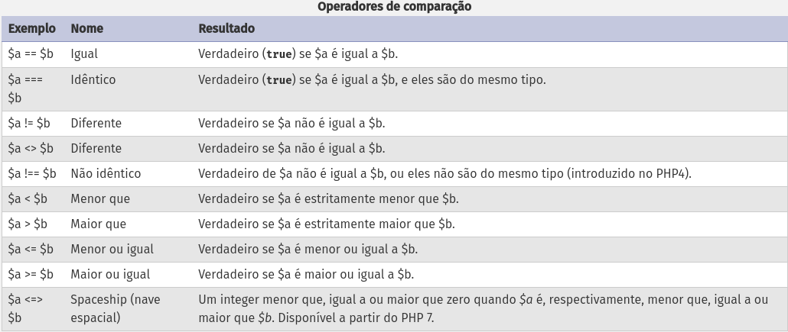
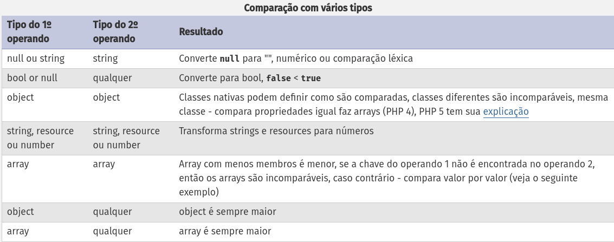
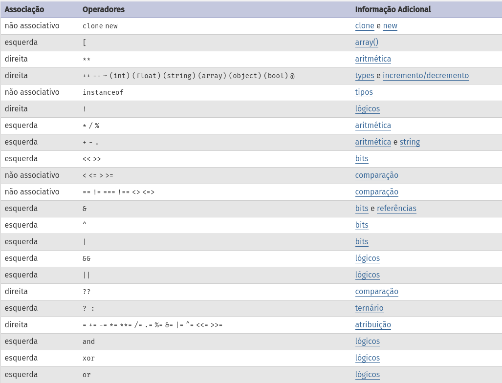

# Operadores de comparação

> disponível em: https://www.php.net/manual/pt_BR/language.operators.comparison.php

# Comparação de tipos

> disponível em: https://www.php.net/manual/pt_BR/language.operators.comparison.php

# Precedência dos operadores

> disponível em: https://www.php.net/manual/pt_BR/language.operators.precedence.php
